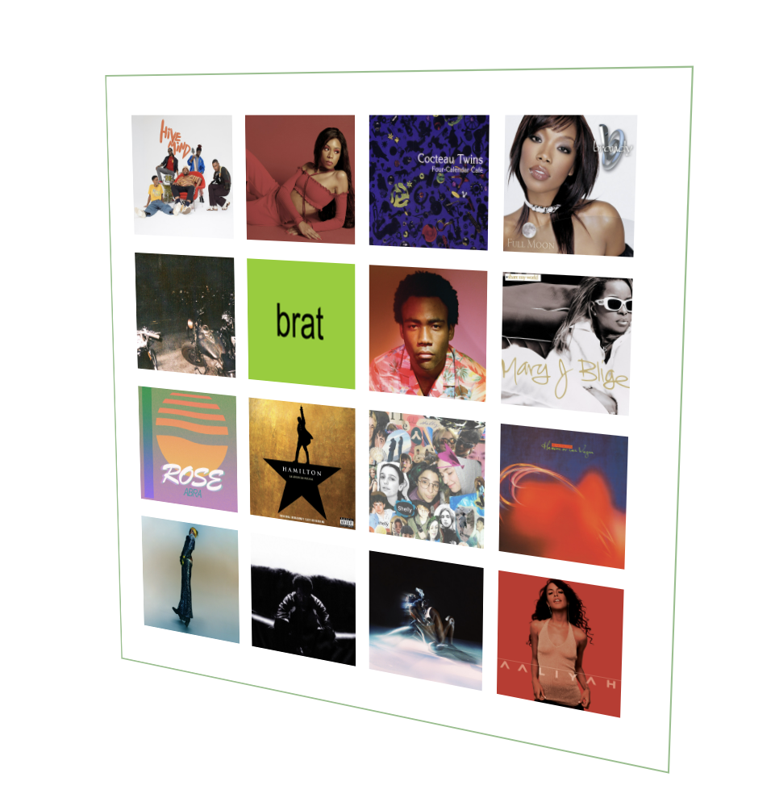

# Album Wall Generator

## Purpose

Recently, I've been seeing room designs that incorporate these aesthetic constructions of album covers on social media. As an indecisive individual (especially when it comes to
room decor), I wondered if there was a way to gather inspiration as to what a wall filled with the album covers I loved would look like.

## Approach + How it Works

I decided to create this application to generate inspiration for album walls, by using the Spotify API to query the user's top tracks and retrieve images of their top albums through their favorite music. I also realized that those with roommates, friends, or significant others might share the same spaces which would fit for a feature that combines the users' top tracks to create a group album wall. Upon this realization, I implemented a server for groups where users can join another user's group to contribute to an album wall. 

# If you're curious :)

This is what my generated album wall looks like!

